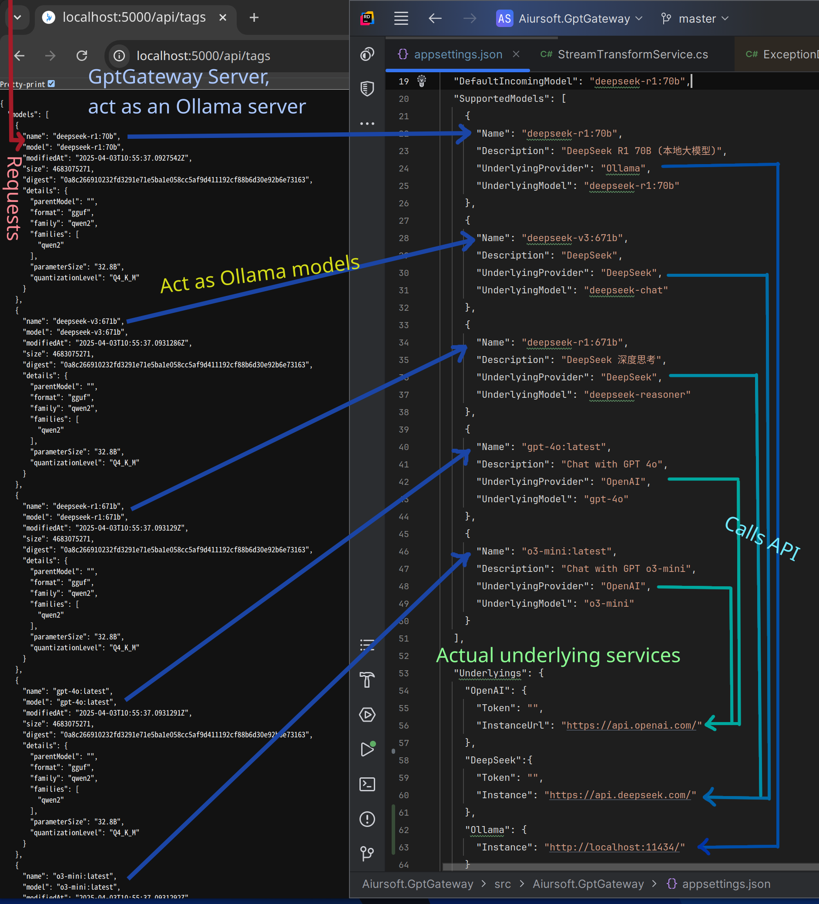

# GptGateway

[](https://gitlab.aiursoft.com/aiursoft/GptGateway/-/blob/master/LICENSE)
[](https://gitlab.aiursoft.com/aiursoft/GptGateway/-/pipelines)
[](https://gitlab.aiursoft.com/aiursoft/GptGateway/-/pipelines)
[](https://gitlab.aiursoft.com/aiursoft/GptGateway/-/commits/master?ref_type=heads)
[](https://openweb.aiursoft.com/)
[](https://hub.docker.com/r/aiursoft/gptgateway)

GptGateway seamlessly masquerades as an Ollama server, unifying diverse API interactions for streamlined AI chat solutions.



| Provider     | Chat Support | Stream Chat  |
|--------------|--------------|--------------|
| Ollama       | ✅            | ✅            |
| OpenAI API   | ✅            | ✅            |
| DeepSeek API | ✅            | ✅            |

If you've already implemented the front-end for Openweb-ui or any AI chat tool based on Ollama, you are likely familiar with the challenge of managing the diverse APIs of various underlying services like OpenAI, Deepseek, and Ollama. This often leads to a cumbersome process of ensuring compatibility and adaptation across different platforms.

GptGateway is designed to address these challenges by seamlessly integrating with your existing setup. It operates by masquerading as an Ollama server, providing APIs that are fully compatible with Ollama's specifications. This ensures effortless support for any Ollama-based front-end you may be using.

- **Unified API Interface**: GptGateway allows you to manipulate JSON and create multiple models, named as you see fit. You can then configure these models to interact with the appropriate underlying services.
- **Simplified Coupling**: Your application only needs to couple with Ollama, significantly reducing complexity.
- **API Translation**: GptGateway handles the translation of requests and responses to match the APIs of different service providers.
- **Streaming Support**: The gateway supports streaming transmission.

By leveraging GptGateway, you can streamline your development process and focus on building robust AI chat solutions without the hassle of dealing with disparate API protocols.

## Try

Try a running GptGateway [here](https://openweb.aiursoft.com/).

## Run in Ubuntu

The following script will install\update this app on your Ubuntu server. Supports Ubuntu 25.04.

On your Ubuntu server, run the following command:

```bash
curl -sL https://gitlab.aiursoft.com/aiursoft/GptGateway/-/raw/master/install.sh | sudo bash
```

Of course, it is suggested that append a custom port number to the command:

```bash
curl -sL https://gitlab.aiursoft.com/aiursoft/GptGateway/-/raw/master/install.sh | sudo bash -s 8080
```

It will install the app as a systemd service, and start it automatically. Binary files will be located at `/opt/apps`. Service files will be located at `/etc/systemd/system`.

## Run manually

Requirements about how to run

1. Install [.NET 9 SDK](http://dot.net/) and [Node.js](https://nodejs.org/).
2. Execute `npm install` at `wwwroot` folder to install the dependencies.
3. Execute `dotnet run` to run the app.
4. Use your browser to view [http://localhost:5000](http://localhost:5000).

## Run in Microsoft Visual Studio

1. Open the `.sln` file in the project path.
2. Press `F5` to run the app.

## Run in Docker

First, install Docker [here](https://docs.docker.com/get-docker/).

Then run the following commands in a Linux shell:

```bash
image=aiursoft/gptgateway
appName=gptgateway
sudo docker pull $image
sudo docker run -d --name $appName --restart unless-stopped -p 5000:5000 -v /var/www/$appName:/data $image
```

That will start a web server at `http://localhost:5000` and you can test the app.

The docker image has the following context:

| Properties  | Value                               |
|-------------|-------------------------------------|
| Image       | aiursoft/gptgateway |
| Ports       | 5000                                |
| Binary path | /app                                |
| Data path   | /data                               |
| Config path | /data/appsettings.json              |

## How to contribute

There are many ways to contribute to the project: logging bugs, submitting pull requests, reporting issues, and creating suggestions.

Even if you with push rights on the repository, you should create a personal fork and create feature branches there when you need them. This keeps the main repository clean and your workflow cruft out of sight.

We're also interested in your feedback on the future of this project. You can submit a suggestion or feature request through the issue tracker. To make this process more effective, we're asking that these include more information to help define them more clearly.
